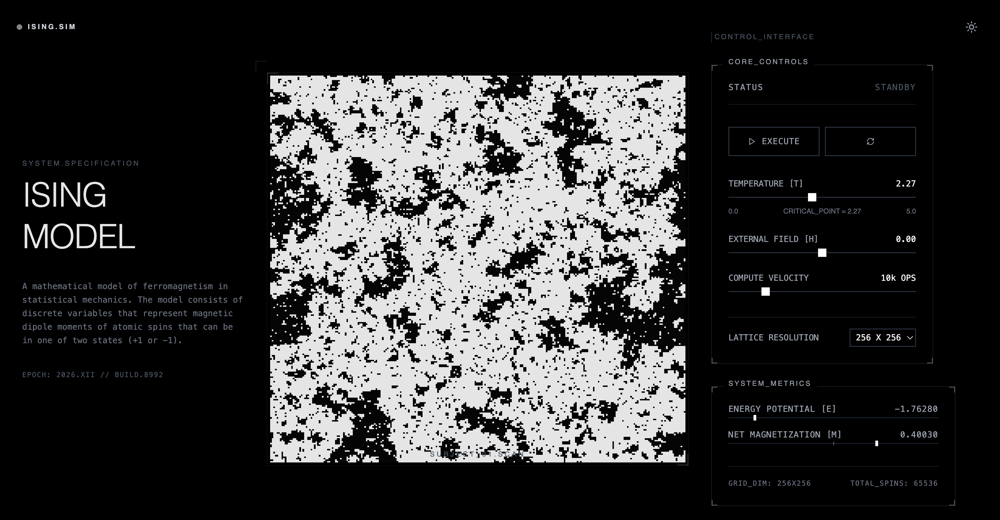

# Ising Model Simulation

> A high-performance, interactive visualization of the 2D Ising Model of ferromagnetism, built with React, TypeScript, and the HTML5 Canvas API.



## Overview

This project implements a **Monte Carlo simulation** of the Ising Model using the **Metropolis-Hastings algorithm**. It visualizes the phase transition behavior of ferromagnetic materials as they interact with temperature and external magnetic fields.

## Key Features

### Physics Engine
- **Metropolis-Hastings Algorithm**: Efficiently samples the system's state space to simulate thermal fluctuations.
- **Real-Time Statistical Mechanics**: meaningful calculation of **Energy per Spin ($E$)** and **Magnetization per Spin ($M$)**.
- **Critical Phenomena**: Observe phase transitions around the theoretical critical temperature ($T_c \approx 2.27$).

### Visualization & UI
- **Canvas-Accelerated Rendering**: Direct pixel manipulation (`Uint32Array`) allows for smooth rendering of large grids (up to 512x512) at 60fps.
- **Axiomatic Design System**: A strictly technical, monochrome user interface featuring:
  - **Adaptive Theming**: Toggle between "Void" (Deep Black) and "Lab" (Clinical White) modes.
  - **Responsive Dashboard**: A 3-column layout that scales from desktop workstations to mobile devices.
  - **System Metrics**: Live visualization of energy potentials and magnetic alignment using precise indicators.

## Interactive Controls

The simulation allows real-time perturbation of the system's parameters:

| Parameter | Symbol | Description |
|-----------|:------:|-------------|
| **Temperature** | $T$ | Controls thermal noise. Below $T_c \approx 2.27$, spins align (Ferromagnetic). Above $T_c$, disorder prevails (Paramagnetic). |
| **External Field** | $H$ | Applies a uniform magnetic bias, forcing spins to align up (+1) or down (-1) regardless of temperature. |
| **Compute Velocity** | $\omega$ | Adjusts the simulation speed (Monte Carlo steps per frame) to balance performance and visual observation. |
| **Lattice Resolution** | $L$ | Changes the grid size ($64^2$ to $512^2$). Larger grids exhibit sharper phase transitions but require more computation. |

## Technical Stack

- **Framework**: React 18 + TypeScript
- **Build Tool**: Vite
- **Styling**: Tailwind CSS (Custom "Axiomatic" configuration)
- **Rendering**: HTML5 Canvas API (Pixel manipulation)
- **Icons**: Lucide React

## Getting Started

### Prerequisites
- Node.js (v18 or higher)
- npm or yarn

### Installation

```bash
# Clone the repository
git clone https://github.com/okuhlemadondo/ising-model.git

# Navigate to directory
cd ising-model

# Install dependencies
npm install
```

### Running Locally

```bash
npm run dev
```
Open [http://localhost:5173](http://localhost:5173) to view the simulation.

## The Physics (Briefly)

The energy of the system is defined by the Hamiltonian:

$$ H(\sigma) = -J \sum_{\langle i, j \rangle} \sigma_i \sigma_j - h \sum_j \sigma_j $$

Where:
- $\sigma_i$ is the spin at site $i$ ($+1$ or $-1$).
- $\langle i, j \rangle$ sum over nearest neighbors.
- $J$ is the interaction coefficient ($J>0$ for ferromagnetism).
- $h$ is the external magnetic field.

At low temperatures, the first term dominates, causing neighbors to align. At high temperatures, thermal fluctuations overcome this interaction, leading to a random, disordered state.

## License

MIT License. Free to use for educational and research purposes.